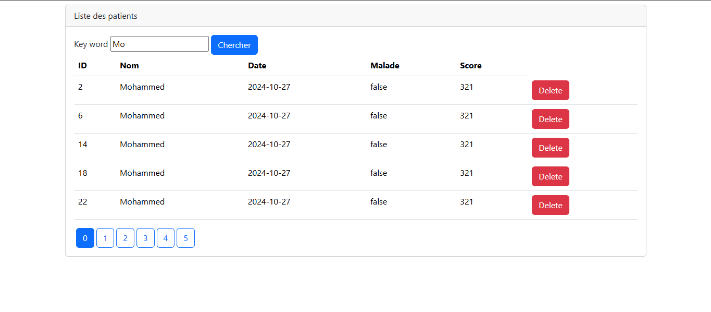

<h1>Spring MVC - Gestion des Patients</h1>
<h2>H2 console :</h2>

<h2>Liste des patients affichée dans H2 Database Console :</h2>

<h2>Page d'acceuil :</h2>

<h2>Résultats de la recherche des patients par mot-clé</h2>

<h2>Suppression d'un patient</h2>

<h2>Affichage sous format JSON: </h2>

